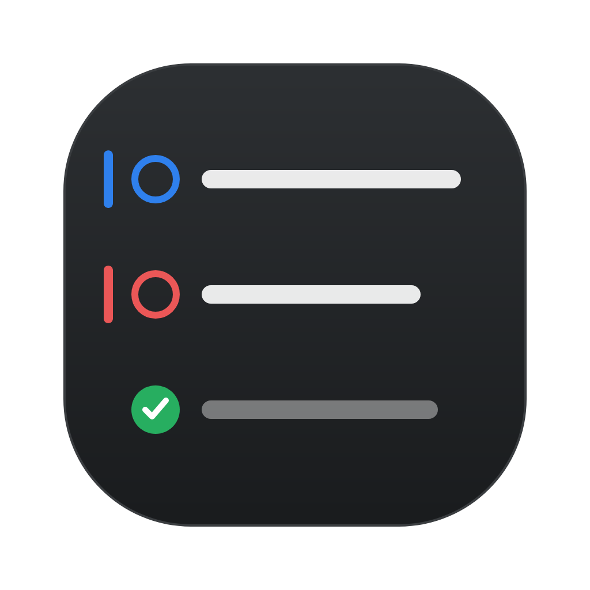
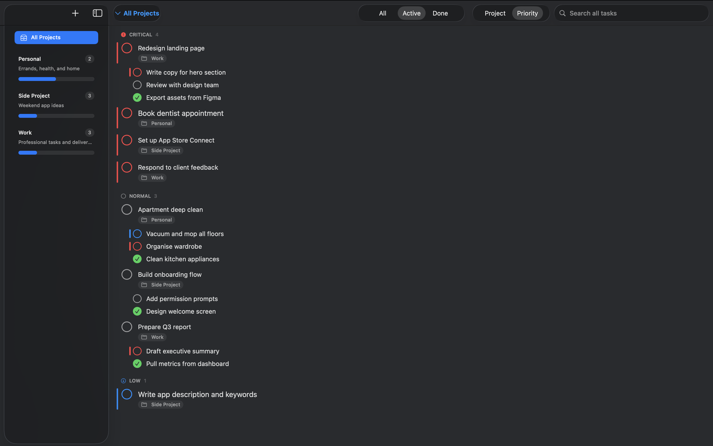

<p align="center">
  
</p>

<h1 align="center">Quillpoint</h1>

<p align="center"><strong>A calm, keyboard-first task manager for macOS.</strong></p>

<p align="center">
  
  
  
</p>

Quillpoint keeps your work in plain, nestable lists you can fly through without
ever reaching for the mouse — type a task, hit Return for the next, Tab to nest
it under the last. It's a native SwiftUI app: fast, quiet, and built to stay out
of your way. And because losing a to-do list is its own small disaster, every
restore snapshots your current data first, so nothing you do is one click from
gone.



## Why Quillpoint

- **Write, don't fill out forms.** Tasks are rich text — **bold**, *italic*, and
  links right in the title or notes. Paste from anywhere; formatting comes along.
- **Structure that bends to you.** Drag to reorder, drop one task onto another to
  nest it, drag a subtask out to promote it. Completed work quietly sinks to the
  bottom so the top of your list is always what's next.
- **Fingers on the keys.** Arrow keys, Return, and Tab/Shift+Tab move, create,
  and nest tasks without a single click. ⌘N for a new item, ⌘, for settings.
- **Two ways to look at it.** A focused, per-project list when you're heads-down,
  or an All Projects view grouped by project or priority when you're planning.
- **Reminders that reach you.** Attach a date and time to any task and get a
  native macOS notification with a "Mark Done" action built in.
- **Yours to keep.** Full undo/redo, automatic backups on a schedule you choose,
  and one-click restore that always backs up your current state first.

## Requirements

- macOS 15 or later
- Xcode 16 or later

## Getting Started

```bash
git clone https://github.com/Yegor689/Quillpoint.git
```

Open `TaskTracker.xcodeproj` in Xcode and run (⌘R). No dependencies, no setup —
pure SwiftUI and SwiftData.

## Architecture

The app is a SwiftUI `NavigationSplitView` over a SwiftData store. UI lives in
`Views/`, with `@Observable` stores (`TaskStore`, `ProjectStore`,
`BackupManager`, `ReminderManager`, `AppSettings`) handling mutations and side
effects. Backups use SQLite's online-backup API for consistent, WAL-safe
snapshots, and restore happens in place so the window updates live. See
[docs/MODEL.md](docs/MODEL.md) for the data model and a view/manager breakdown.

## License

MIT
